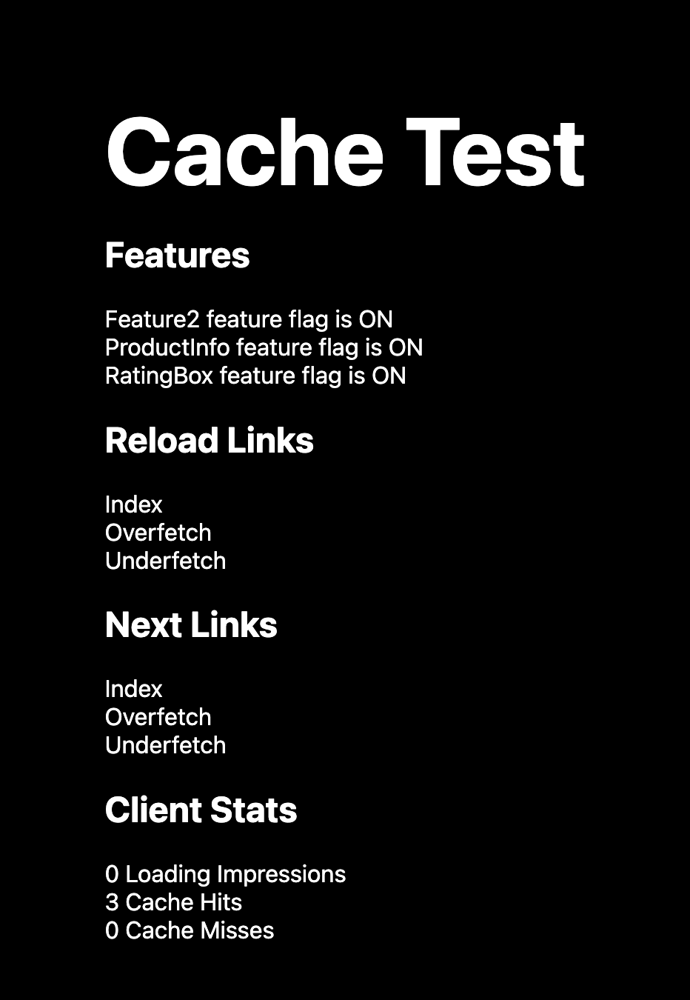

# Causal SSR Sample app

## Running

This is a sample app showing the use of server side rendering with Causal, built on Next.js

To run the development server:

```bash
npm run dev
# or
yarn dev
11
```

The sample app will be running on [http://localhost:8080](http://localhost:8080)
​

## Displayed Stats

### Server side

On the server side, this example will output cache stats to the stdout. See the use of `StatsLogger` in [`pages/_app.tsx`](pages/_app.tsx). It will look like similar to this:

> WARNING!: The following features were spuriously cached: ["RatingBox"]. Please make sure your page (route pathname = /overfetch) is not needlessly requesting them in getInitialProps

### Client side

In the Browser, the app stats will be rendered to the html.


